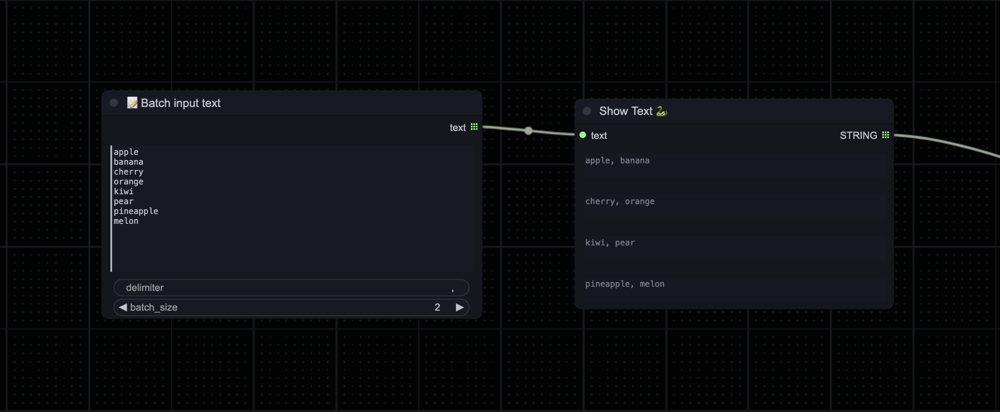
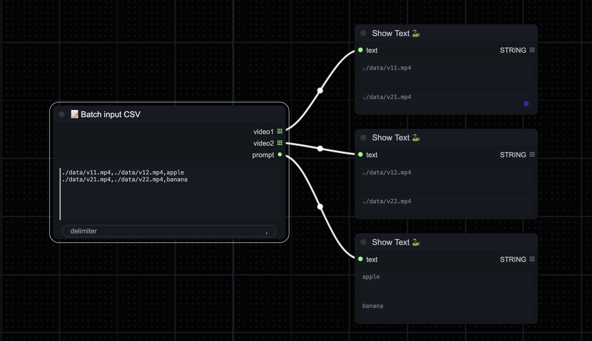

# ComfyUI Batch Input Node

## Feature

- [x] Batch Input Text Node.
- [ ] Batch Input Image Node.

## Getting Started

```shell
cd ComfyUI/custom_nodes

git clone https://github.com/Video3DGenResearch/comfyui-batch-input-node.git

# restart ComfyUI
```

select `Add Node` -> `🐳BatchInput` -> `📝Batch input *`.

## Node

### Batch Input Text Node


- **text_list**: the multiline input text(default `apple\nbanana\ncherry\norange\nkiwi\npear\npineapple\nmelon`)
- **delimiter**: used to join text lists(default `, `)
- **batch size***: the size of the text batch generated each time(default `1`, min 1, max 100, step 1)

### Batch Input CSV Node

- **text_list**: the multiline input text(default `"./data/v11.mp4,./data/v12.mp4,apple\n./data/v21.mp4,./data/v22.mp4,banana"`)
- **delimiter**: used to join text lists(default `,`)

## Reference

- [ComfyUI](https://github.com/comfyanonymous/ComfyUI)
- [ComfyUI-Manager](https://github.com/ltdrdata/ComfyUI-Manager)

## License

[MIT License](./LICENSE)
