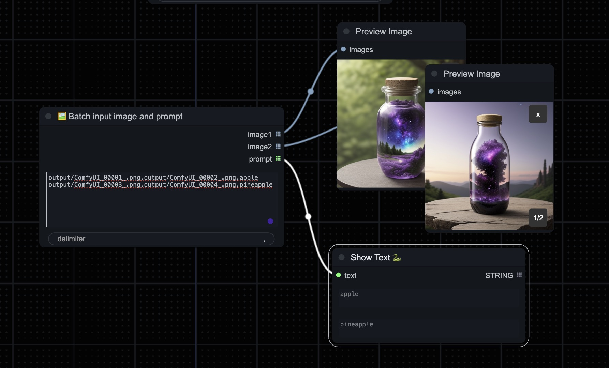

# ComfyUI Batch Input Node

## Feature

- [x] Batch Input Text Node.
- [x] Batch Input CSV Node.
- [x] Batch Input Image and prompt Node.

## Getting Started

```shell
cd ComfyUI/custom_nodes

git clone https://github.com/Video3DGenResearch/comfyui-batch-input-node.git

pip install -r requirements.txt

# restart ComfyUI
```

select `Add Node` -> `🐳BatchInput` -> `📝Batch input *`.

## Node

### Batch Input Text Node


- **text_list**: the multiline input text
- **delimiter**: used to join text lists (default `, `)
- **batch size***: the size of the text batch generated each time(default `1`, min 1, max 100, step 1)

### Batch Input CSV Node


- **text_list**: csv text 
- **delimiter**: used to split csv line (default `,`)

### Batch Input Image and Prompt Node



- **text_list**: csv text 
- **delimiter**: used to split csv line (default `,`)

## Reference

- [ComfyUI](https://github.com/comfyanonymous/ComfyUI)
- [Comfy Custom Node How-To](https://github.com/chrisgoringe/Comfy-Custom-Node-How-To/wiki)
- [ComfyUI-Manager](https://github.com/ltdrdata/ComfyUI-Manager)

## License

[MIT License](./LICENSE)
